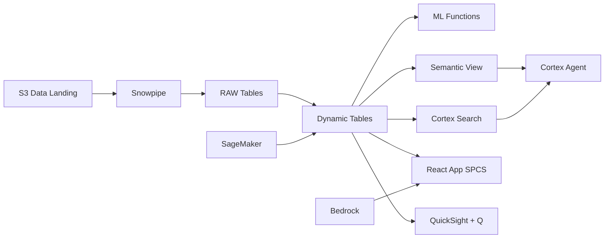

# Client Portfolio & Revenue Analytics

Philippine BPOs manage multi-billion peso client portfolios — Snowflake builds real-time client health scores with Dynamic Tables, exports to Iceberg for cross-platform reporting, and enables revenue intelligence at scale.

## Architecture

A leading Philippine BPO manages a ₱4.8 billion client portfolio across 58 enterprise clients spanning finance, healthcare, telecom, retail, and technology. Seven clients are deteriorating — three have renewals in 90 days. But client health data lives in 6 disconnected systems. Snowflake unifies delivery, satisfaction, and financial data into a single health score, predicts churn, and exports via Iceberg for organization-wide visibility.



## Snowflake Capabilities

| Capability | Implementation |
|-----------|---------------|
| Dynamic Tables | CLIENT_HEALTH_SCORE / REVENUE_360 / RENEWAL_PIPELINE / PORTFOLIO_CONCENTRATION |
| ML Functions | ML.CLASSIFICATION + ML.FORECAST |
| Cortex AI | COMPLETE, AI_CLASSIFY |
| Cortex Search | 500 documents indexed |
| Cortex Agent | PORTFOLIO_INTELLIGENCE_AGENT |
| Semantic View | CLIENT_PORTFOLIO_ANALYTICS |
| React App (SPCS) | 5 tabs + DemoGuide |


## AWS Services

| Service | Role in Demo |
|---------|-------------|
| Amazon S3 (Iceberg) | Open table format for cross-platform client reports |
| Amazon Athena | Query Iceberg data from non-Snowflake consumers |
| Amazon SageMaker | Client churn prediction model |
| Amazon Bedrock (Claude) | Generate account intelligence narratives |
| Amazon QuickSight + Q | Portfolio analytics dashboard for account teams |
| AWS Lake Formation | Govern Iceberg data access across teams |


## Personas

| Persona | Role | Key Questions |
|---------|------|---------------|
| **Isabella Sofia Ayala-Zobel** | Chief Revenue Officer | "What's our revenue growth by vertical this quarter?" "Which clients are at risk of churn?" |
| **Antonio Miguel Sy** | Account Director | "What's the margin trend for my top 5 accounts?" "Which contracts are up for renewal in Q1?" |


## Data

| Table | Rows | Description |
|-------|------|-------------|
| CLIENTS | 58 | Enterprise client profiles (US, UK, AU, SG Fortune 500 companies) |
| CONTRACTS | 124 | Active contracts with terms, value, renewal dates |
| REVENUE_TRANSACTIONS | 340,000 | Monthly revenue recognition by client, service line, site |
| DELIVERY_METRICS | 580,000 | Monthly delivery KPIs per client (utilization, quality, timeliness) |
| CLIENT_SURVEYS | 2,400 | Quarterly client satisfaction surveys and NPS |
| MARKET_INTELLIGENCE | 500 | Industry reports on BPO market size, growth, and competition |


## Build Instructions

### Prerequisites
- Snowflake account with ACCOUNTADMIN access
- Cortex AI enabled (ML Functions, Search, Agent)
- Warehouse: PORTFOLIO_WH (Medium)
- AWS CLI with access (us-west-2)

### Deployment

```bash
snowsql -f snowflake/00_setup.sql
snowsql -f snowflake/01_marketplace_install.sql
snowsql -f snowflake/02_raw_tables.sql
snowsql -f snowflake/03_staging.sql
snowsql -f snowflake/04_dynamic_tables.sql
snowsql -f snowflake/05_search.sql
snowsql -f snowflake/06_ml_models.sql
snowsql -f snowflake/07_semantic_view.sql
snowsql -f snowflake/08_agent.sql
```

### React App (SPCS)
```bash
cd app && npm ci && npm run build
docker build -t aws-philippines-bpo-client-portfolio-app .
docker push bdiqc8sm-default.registry.snowflakecomputing.com/client_portfolio/app/aws_philippines_bpo_client_portfolio/app:latest
```

### Demo Mode
Open the app URL with `?demo=true` for presenter view.

## Build Modes

### Snowflake Only
Run scripts 00-08 (skip AWS-specific integration). Uses:
- **Iceberg Tables (native)** instead of Amazon S3 (Iceberg)
- **Iceberg interop (open format)** instead of Amazon Athena
- **ML.CLASSIFICATION (native)** instead of Amazon SageMaker
- **Cortex Complete** instead of Amazon Bedrock (Claude)
- **Snowflake Intelligence (Cortex Analyst)** instead of Amazon QuickSight + Q
- **Snowflake RBAC + Dynamic Data Masking** instead of AWS Lake Formation

### Full AWS + Snowflake
Run all scripts including AWS integration. Deploy QuickSight dashboard from `quicksight/`.

## Business Impact

Industry research and Snowflake customer outcomes:
- **Client retention improvement of 5% increases BPO profitability by 25-95%** — [Bain & Company](https://www.bain.com/insights/the-value-of-online-customer-loyalty/)
- **Philippines IT-BPM revenue reached $32.5B in 2023 with 8.4% growth** — [IBPAP](https://ibpap.org/industry-facts-and-figures)
- **Proactive account management reduces churn 20-30% in professional services** — [McKinsey B2B](https://www.mckinsey.com/capabilities/growth-marketing-and-sales/our-insights)
- **Open table formats like Iceberg reduce data platform lock-in costs by 40%** — [Snowflake Engineering](https://www.snowflake.com/engineering-blog/)


## Key Demo Numbers

- **₱4.8B** annual revenue across 58 enterprise clients
- **7 clients** below 60 health score (at-risk)
- **3 renewals** within 90 days for at-risk clients (₱620M exposure)
- **16.2%** revenue concentration in top client (above threshold)
- **₱340M** upsell pipeline identified by AI
- **8.4%** forecasted revenue growth next quarter


## License

Apache 2.0 — See [LICENSE](LICENSE) for details.

This is a personal demo project and is not an official Snowflake offering. It comes with no support or warranty.